<h1 align="center">Welcome to A2Z DSA Tracker 👋</h1>

## 🚀 Aim
The A2Z DSA Tracker project aims to revolutionize the way you prepare for technical interviews! Our platform offers a comprehensive solution for organizing, tracking, and managing data structures and algorithms (DSA) practice questions.

## 📝 Introduction
Say goodbye to scattered notes and disorganized study materials! The A2Z DSA Tracker is a user-friendly web application designed to help you efficiently prepare for technical interviews. With our centralized platform, you can easily track your progress on DSA questions and stay on top of your preparation.

## ✨ Features
- **User Authentication**: Users can create an account and log in to track their DSA practice progress.
- **Browse Questions**: Users can browse through a collection of DSA questions categorized by topics.
- **Mark Progress**: Users can mark the status of each question (Done, Revisit, Pending) to track their progress.
- **Dashboard**: Users have access to a dashboard displaying their overall progress and statistics.
- **Responsive Design**: The application is responsive and optimized for various screen sizes.
- **Admin Panel**: Admins can manage questions and categories with an intuitive interface.
- **Search and Filter**: Easily find questions by searching or filtering based on various criteria.
- **User Roles**: Different access levels for users and admins to ensure secure and efficient management.
- **Customizable Settings**: Personalize your experience with customizable settings and preferences.
- **Super Admin Role**: Super Admins have the authority to allocate admin roles to other users.

## 📸 Screenshots
<!-- Add your screenshots here -->
<div style="display: flex; flex-wrap: wrap; gap: 10px; justify-content: center;">
  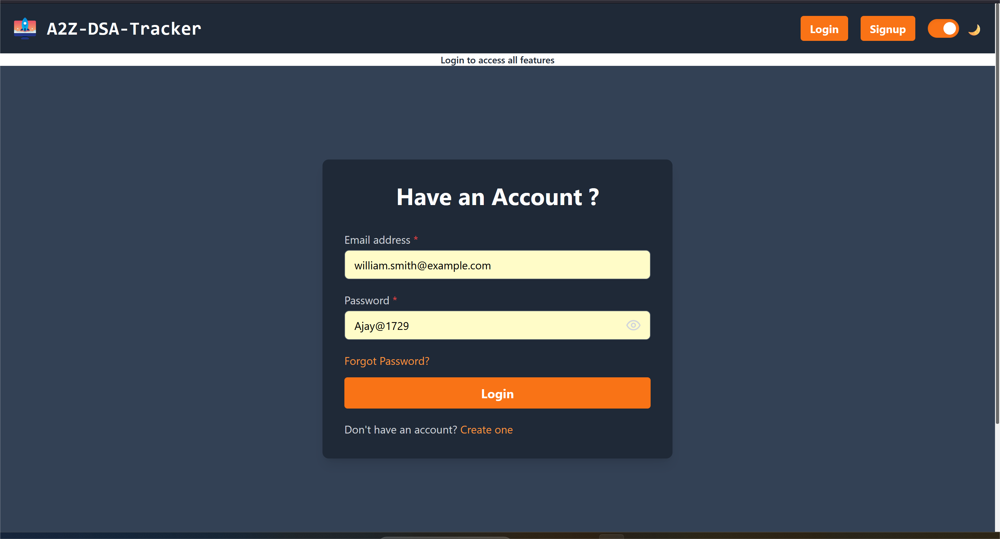
  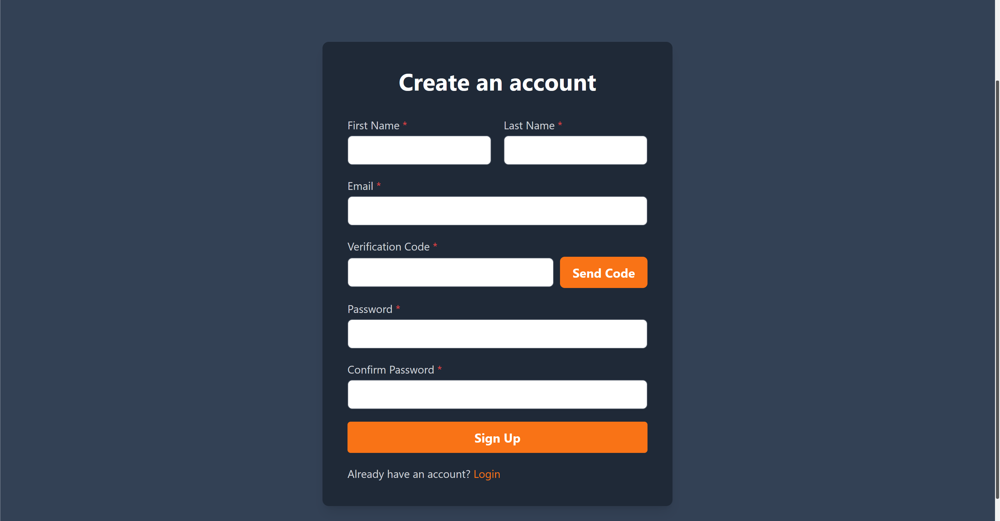
  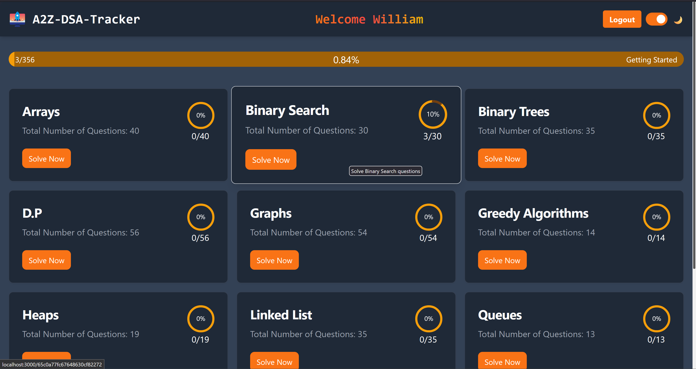
  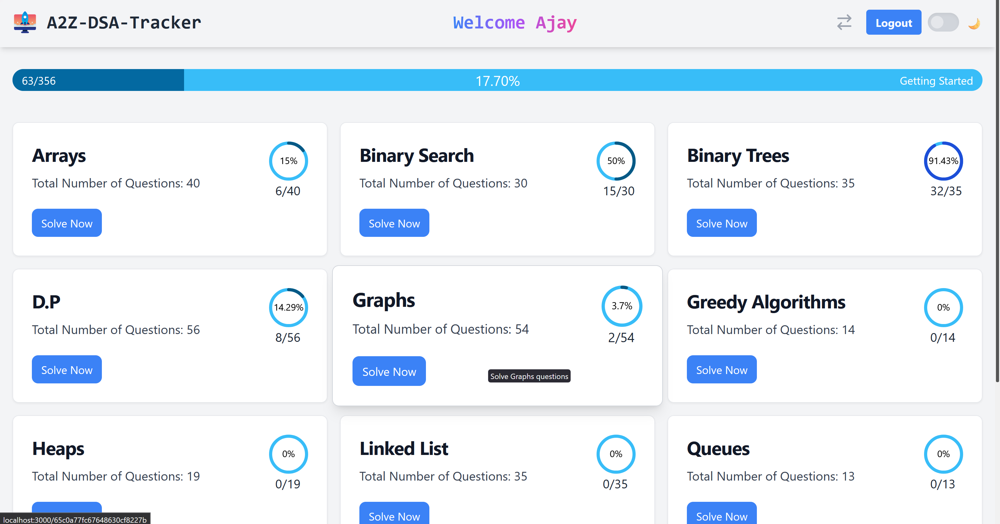
  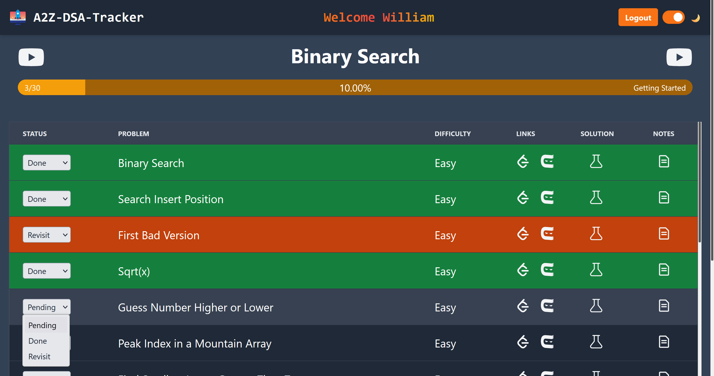
  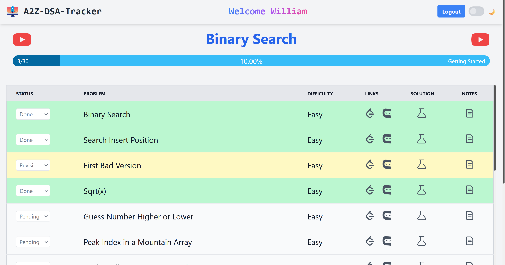
  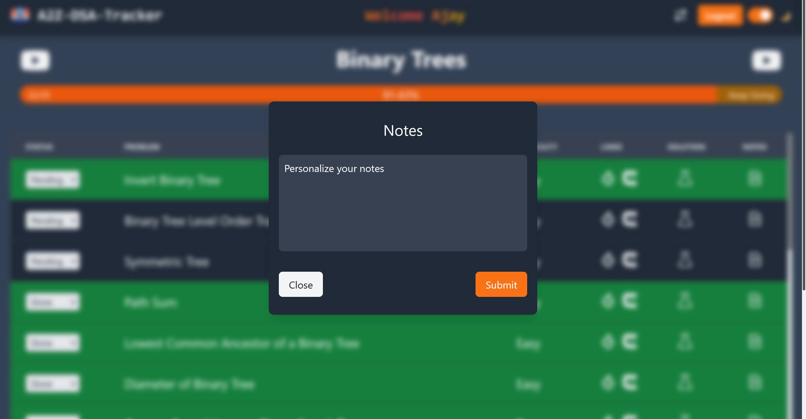
  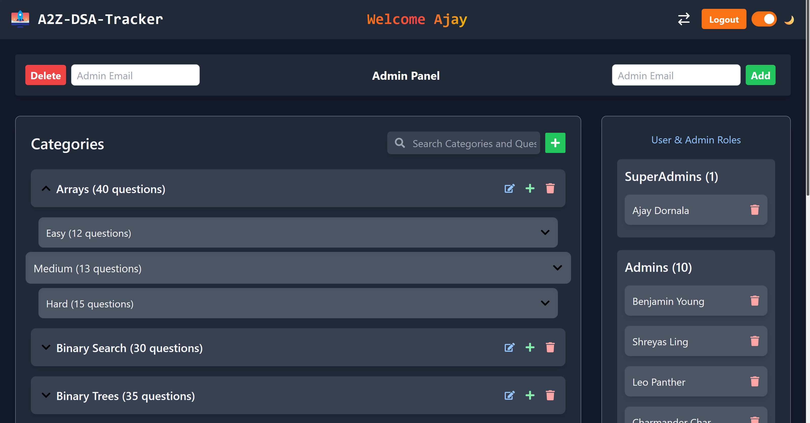
  
  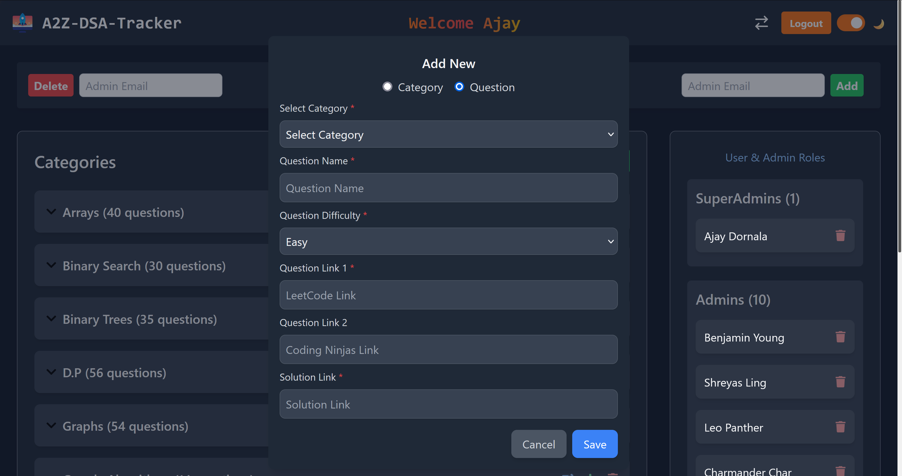
  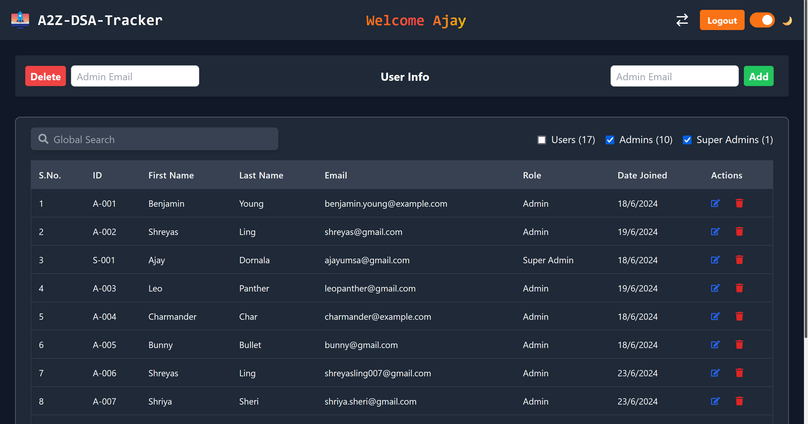
  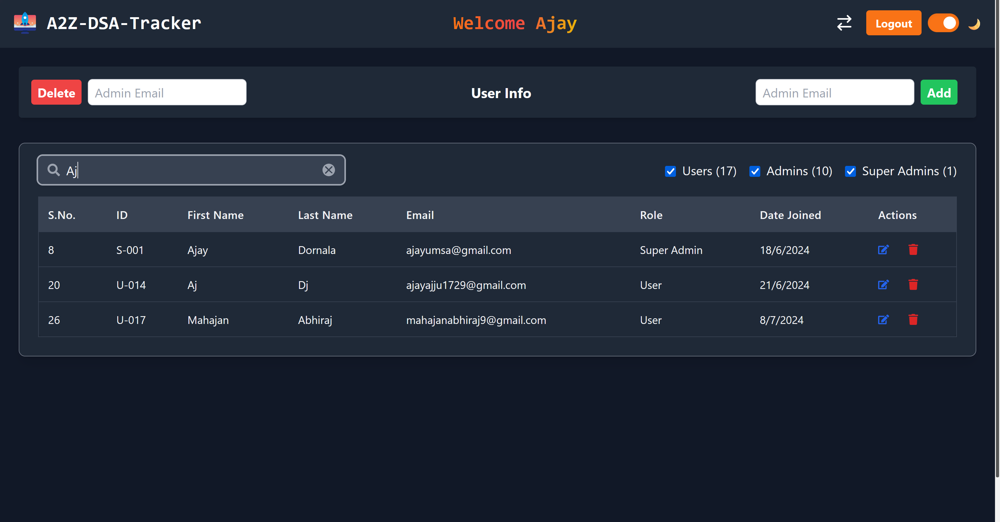
</div>


## Install

```sh
npm install
```

## Usage

```sh
npm run start
```

## Run tests

```sh
npm run test
```

## 🛠️ Technologies Used
- **MongoDB**: Database for storing DSA questions and user data.
- **Express.js**: Backend framework for handling API requests.
- **React**: Frontend library for building user interfaces.
- **Node.js**: Runtime environment for running the backend server.
- **Tailwind CSS**: Utility-first CSS framework for styling the application.

## 📚 References
- [Tailwind CSS Documentation](https://tailwindcss.com/docs)
- [React Documentation](https://reactjs.org/docs)
- [MongoDB Documentation](https://docs.mongodb.com)
- [Express.js Documentation](https://expressjs.com/en/4x/api.html)
- [Node.js Documentation](https://nodejs.org/en/docs)

## 📊 Results
The A2Z DSA Tracker has been successfully implemented and has received positive feedback from our team during testing. We are confident in its functionality and performance.

## 🎉 Conclusion
We are excited about the potential impact of the A2Z DSA Tracker. Join us as we continue to refine and improve the platform to make it even more valuable for technical interview preparation.

## 🚀 Deployment
The application is hosted on Vercel and can be accessed at the following link:

[Visit A2Z DSA Tracker](https://dsa-tracker-react.vercel.app/login)

## 🔗 Backend Repository

The backend of this project is maintained in a separate repository. You can find it here:

[Backend Repository](https://github.com/Ajay-33/DSA_Tracker_Backend)

## 🧑‍💻 Dummy Account Login
To explore the application, you can use the following dummy account credentials:

- **Email**: william.smith@example.com
- **Password**: Ajay@1729

## Show your support
If you found this project helpful, please consider giving it a ⭐️ on GitHub!
